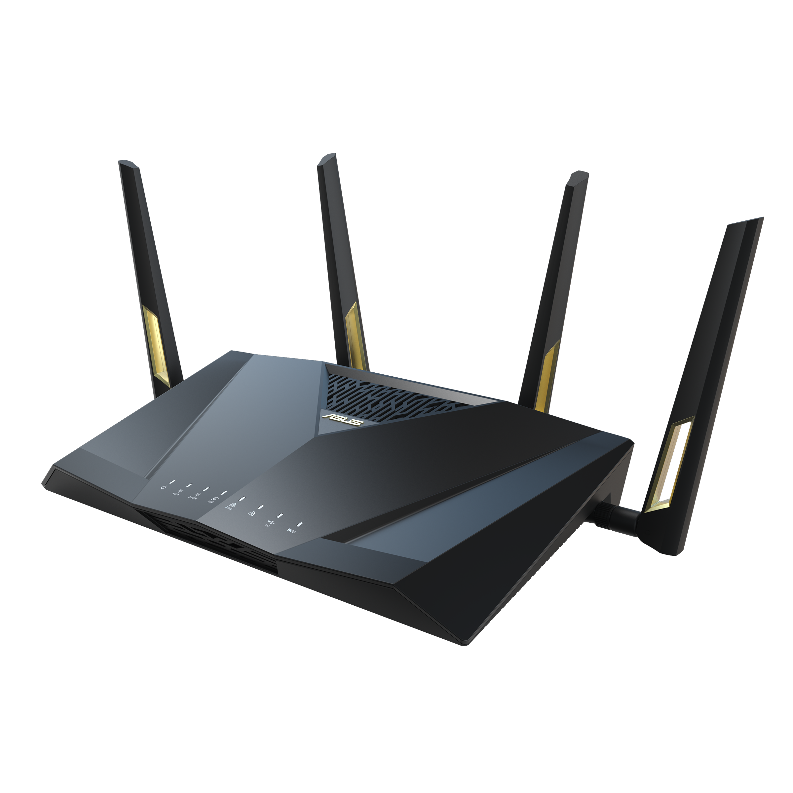
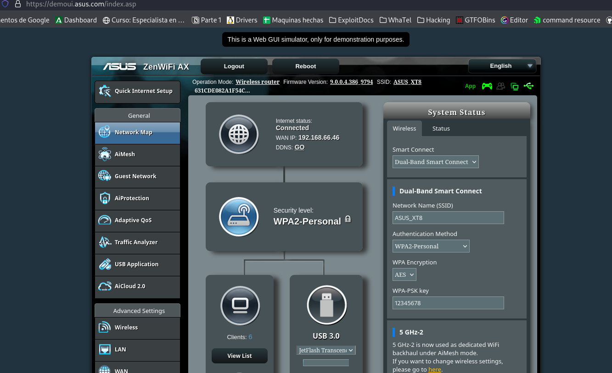
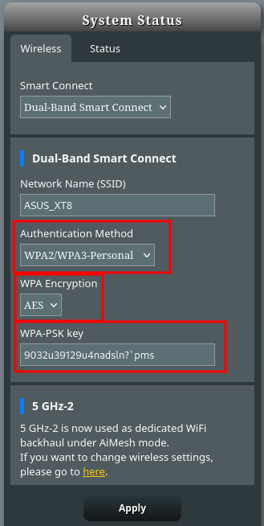
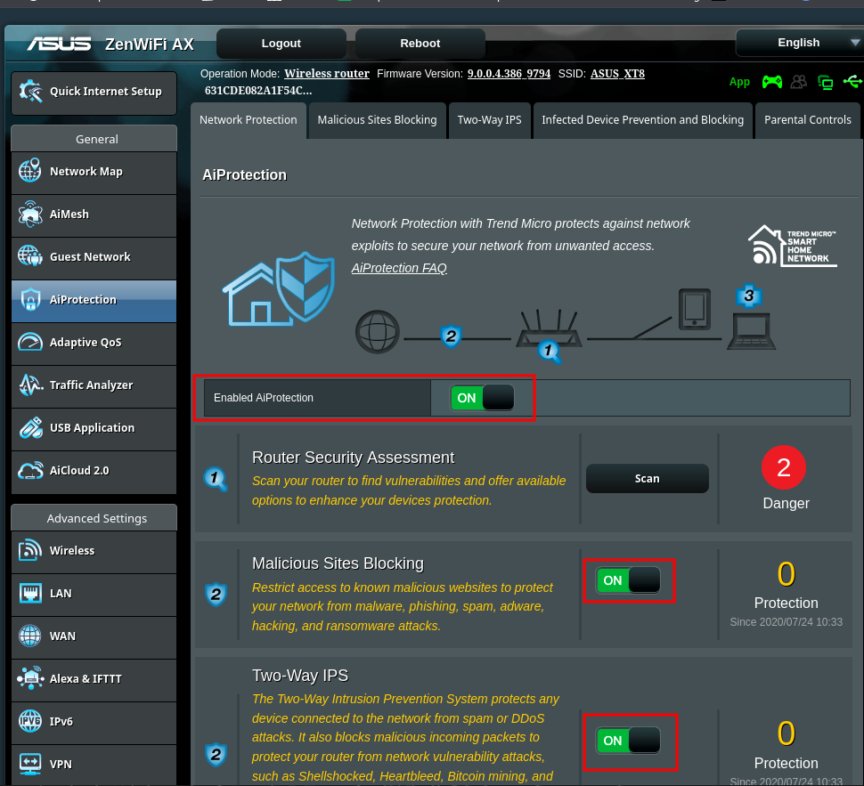
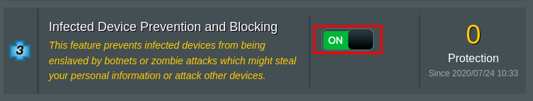
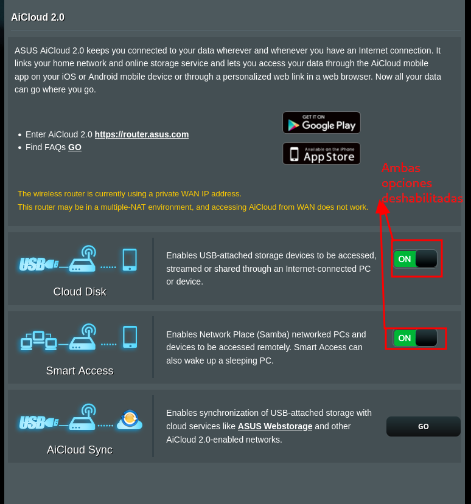
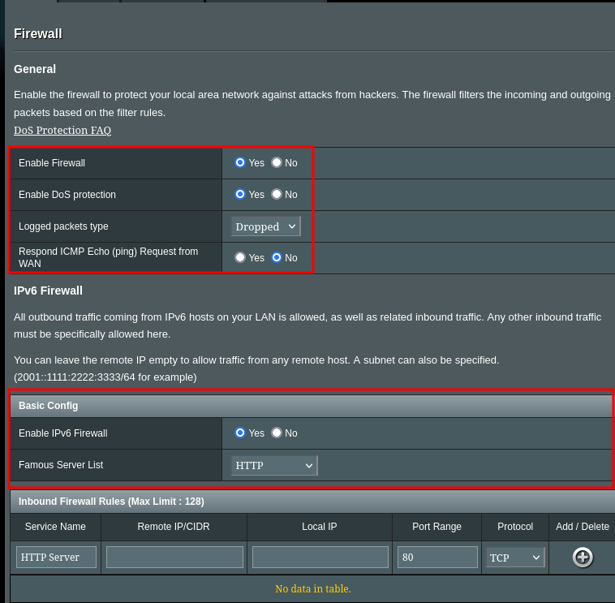
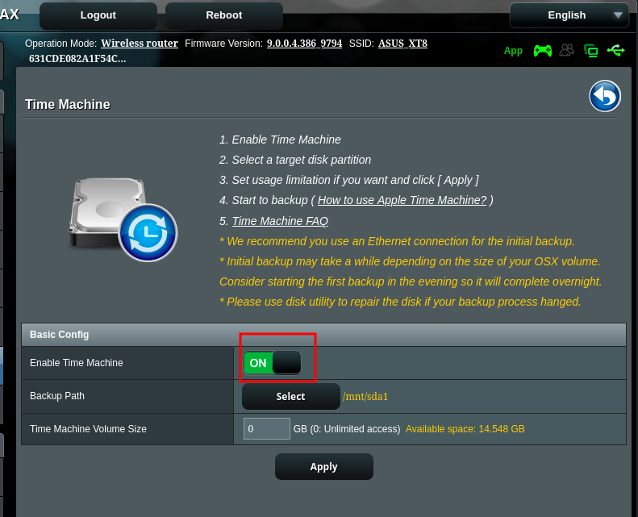

# Proyecto 8: Seguridad en conexiones invisibles

En este proyecto se va a realizar una guía de hardening de un punto de acceso proporcionado en esta [lista](https://routersecurity.org/resources.php#Emulators). En este caso he elegido de forma aleatoria el dispositivo [Asus RT-AX88U](http://demoui.asus.com/index.asp). Es un router "gaming" inalámbrico, entre sus especificaciones tenemos:

| Marca                                          | ‎ASUS                                                                                     |
| ---------------------------------------------- | ----------------------------------------------------------------------------------------- |
| Fabricante                                     | ‎ASUS Spain                                                                               |
| Series                                         | ‎ASUS RT-AX88U ROUTER INALAMBRICO AX6000 AIMESH DOBLE BANDA (2,4 GHZ / 5 GHZ) 3G 4G NEGRO |
| Dimensiones del producto                       | ‎38,5 x 12,6 x 25 cm; 1,01 kg                                                             |
| Pilas                                          | ‎1 Litio Ion (Tipo de pila necesaria)                                                     |
| Número de modelo del producto                  | ‎90IG0820-MO3A00                                                                          |
| Color                                          | ‎multicolour                                                                              |
| Tipo de conectividad                           | ‎Wi-Fi                                                                                    |
| Tipo de conexión inalámbrica                   | ‎802.11n, 802.11b, 802.11a, 802.11g                                                       |
| Número de puertos USB 3.0                      | ‎3                                                                                        |
| Voltaje                                        | ‎19 Voltios                                                                               |
| Sistema operativo                              | ‎RouterOS, Cisco IOS                                                                      |
| Pilas incluidas                                | ‎No                                                                                       |
| Contenido de energía de la batería de litio    | ‎2 Kilovatios-hora                                                                        |
| Embalaje de la batería de litio                | ‎Baterías dentro del paquete del equipo                                                   |
| Peso de la batería de litio                    | ‎2 Gramos                                                                                 |
| Número de pilas de ion de litio                | ‎5                                                                                        |
| Número de pilas de metal de litio              | ‎5                                                                                        |
| Peso del producto                              | ‎1,01 kg                                                                                  |
| Actualizaciones de software garantizadas hasta | ‎desconocido                                                                              |
Sin duda se trata de un router de uso doméstico, con una interfaz bastante detallada, y varias opciones interesantes a nivel de seguridad que vamos a explorar más a fondo.

Usaremos un [emulador web](https://demoui.asus.com/index.asp) que nos proporciona Asus, que simula la interfaz web del router, donde aplicaremos los cambios que usaría en un caso real. Cuando entramos por primera vez vemos el siguiente dashboard:

Ahora vamos a empezar con el hardening del dispositivo. Para ello vamos cambiar las siguientes opciones:

Como vemos, hemos cambiado el método de autenticación a WPA2/WPA3-Personal, esto lo he hecho debido a que WPA3 nos ofrece opciones de seguridad adicionales como el cifrado del proceso de autenticación, evitando ataques como la captura de un paquete de autenticación mediante sniffing y después la posibilidad de hacer fuerza bruta para obtener la contraseña, aún así he decidido seguir utilizando WPA2, esto lo he hecho ya que no todos los dispositivos son compatibles con WPA3, y teniendo en cuenta que es un router doméstico, no me parece conveniente que exista la posibilidad de que algunos dispositivos no puedan conectarse  a la red.

La encriptación solo permite usar AES, es un algoritmo de cifrado de bloques simétrico que cifra datos en bloques de 128 bits utilizando claves de cifrado de 128, 192 o 256 bits. Se considera seguro contra todos los ataques conocidos y se adopta ampliamente como estándar para cifrar datos electrónicos.

Por último he creado una calve segura para poder autenticarse, ya que la que venía por defecto era "123456789", me he encargado de crear una segura usando números, letras y símbolos.

La siguiente opción que vamos a habilitar es la "Ai protection":

Las opciones de seguridad de este router me han sorprendido ya que nunca las había visto en algún otro router, vemos que he habilitado un bloqueo de páginas web maliciosas, una medida de protección ante denegaciones de servicio distribuidas, que además bloquea paquetes considerados maliciosos y otra opción que es capaz de prevenir la conexión de dispositivos infectados con algún malware, funcionando como una especie de antivirus.

El siguiente paso sería deshabilitar AiCloud 2.0:

Aunque las funciones presentadas son interesantes y pueden resultar útiles, parte del hardening es reducir la superficie de ataque  a nuestro sistema, y en este caso, no veo necesarias las funciones de acceso a dispositivos USB ni el acceso remoto a equipos en un dominio Samba con la opción de Wake-on-Lan.

Ahora vamos a revisar el firewall integrado en nuestro dispositivo:

Obviamente vamos a habilitar el firewall y la protección contra denegaciones de servicio, además por defecto, no se crea ningún log de paquetes, pero en mi caso he elegido que los paquetes que el firewall deniegue queden logeados por si se necesitara hacer algún análisis, por último, para dificultar tareas de reconocimiento, he desactivado la respuesta al protocolo ICMP. En cuanto a IPv6, también he habilitado el firewall y como vemos en la zona inferior podríamos configurar nuestras reglas del firewall.

Por último  he habilitado la funcionalidad "Time Machine", que se resume en la creación de copias de seguridad para poder reparar el dispositivo en caso de fallo o corrupción de archivos.

